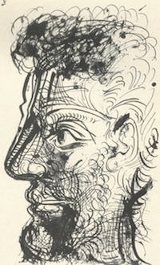
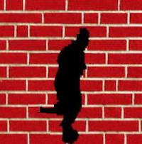
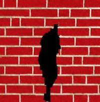
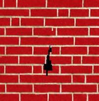
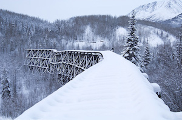
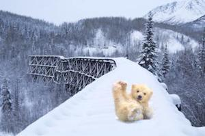
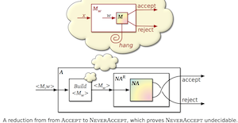
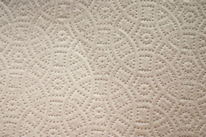

# ImEditor

Intelligent Image Editor 

## Quilting

Reconstruction by sampling patches and stitching along minumum cost seam

### Texture Synthesis

Constructing a large texture image from a small one

 

### Texture Transfer

Stitching patches sampled from source texture to fit target firgure

<!-- .element height="50%" width="50%" -->  

### Hole Filling

Filling the hole by sampling patches from outside the hole and stitching from outer to inner 

   
   

## Blending 

Blend a source area to target image seamlessly

### Possion Blending

  

### Mixed Blending

  

## Face Morphing

[Here](https://youtu.be/vI6KBtKDtrg) is a vedio demo.

